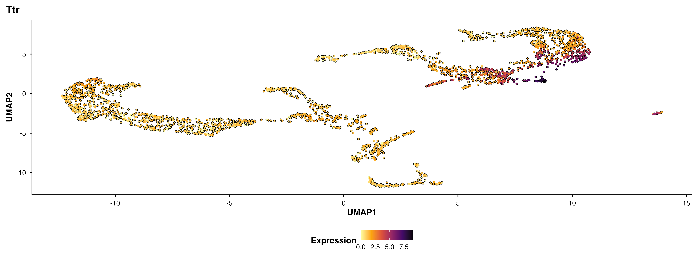

<!-- README.md is generated from README.Rmd. Please edit that file -->

```{r, include = FALSE}
knitr::opts_chunk$set(
  collapse = TRUE,
  comment = "#>",
  out.width = "100%"
)
```

# Visium Powered by BadranSeq

### A spatial transcriptomics analysis guide with publication-ready visualizations

---

## What Is This?

A complete **10x Visium spatial transcriptomics** walkthrough using mouse brain data, rebuilt from the [Seurat spatial vignette](https://satijalab.org/seurat/articles/spatial_vignette) with [BadranSeq](https://github.com/wolf5996/BadranSeq) visualizations replacing Seurat defaults wherever they improve the output.

```
Visium Data ──→ QC ──→ Normalize ──→ Cluster ──→ DEA ──→ Integrate ──→ Multi-Slice
     │              │            │           │        │            │
  stxBrain    BadranSeq     SCTransform   PCA/UMAP  Moran's I   Allen Cortex
  anterior1   ViolinPlot                  DimPlot   FeaturePlot  Label Transfer
  posterior1                              SpatialDimPlot
```

## The Good Stuff

**Spatial expression meets UMAP** — Top spatially variable features shown on the tissue and in embedding space:

*SpatialFeaturePlot (tissue overlay):*

```{r spatial-top-features, echo = FALSE}
knitr::include_graphics("readme_figures/spatial_top_features.png")
```

*BadranSeq::do_FeaturePlot (UMAP embedding):*

```{r badranseq-top-features, echo = FALSE}

```

**Clusters map to anatomy** — UMAP clusters (BadranSeq::do_DimPlot) overlaid on the tissue image:

```{r umap-spatial-clusters, echo = FALSE}
knitr::include_graphics("readme_figures/umap_spatial_clusters.png")
```

## Why BadranSeq?

| Seurat Default | BadranSeq Replacement | Why Bother |
|:---|:---|:---|
| `DimPlot()` | `BadranSeq::do_DimPlot()` | Better color palettes, label placement |
| `FeaturePlot()` | `BadranSeq::do_FeaturePlot()` | Cleaner expression gradients |
| `VlnPlot()` | `BadranSeq::do_ViolinPlot()` | Publication-ready theme |
| `SpatialFeaturePlot()` | *kept as-is* | BadranSeq doesn't do spatial overlays (yet) |

## Quick Start

```r
# Install dependencies
install.packages(c("Seurat", "ggplot2", "patchwork", "readr", "conflicted"))
remotes::install_github("satijalab/seurat-data")
remotes::install_github("wolf5996/BadranSeq")

# Open the project
rstudio scripts.Rproj

# Or render the full guide
quarto render visium_powered_by_badranseq.qmd
```

## How It Works

Every section is a **self-contained code chunk** — loads its own libraries, reads its own checkpoint, does its work, saves outputs. Jump to any section and run it independently.

```
Section N reads checkpoint N-1 ──→ processes ──→ saves checkpoint N
                                             ──→ saves figures to ../write/figures/
```

### Checkpoints

| # | File | What It Contains |
|:---:|:---|:---|
| 01 | `01_brain_seu.rds` | Raw Seurat object |
| 02 | `02_brain_seu_normalized.rds` | SCTransform normalized |
| 03 | `03_brain_seu_clustered.rds` | PCA + UMAP + clusters |
| 04 | `04_brain_seu_spatial_dea.rds` | Spatially variable features (Moran's I) |
| 05 | `05_cortex_seu.rds` | Cortex spatial subset |
| 06 | `06_cortex_seu_integrated.rds` | Allen cortex annotations transferred |
| 07 | `07_brain_merge_seu.rds` | Anterior + posterior merged |

## Project Layout

```
visium_analysis/
├── read/              # Input data (Allen cortex .rds)
├── scripts/           # Analysis code (you are here)
│   ├── visium_powered_by_badranseq.qmd   # The guide
│   └── scripts.Rproj
├── checkpoints/       # Numbered .rds files (compressed)
└── write/
    └── figures/       # All output figures by category
        ├── qc/
        ├── spatial_feature_plot/
        ├── dim_reduction/
        ├── dea/
        ├── integration/
        └── multi_slice/
```

## Opinionated Takes

This guide follows the Seurat vignette structure but includes honest commentary on where the field is heading:

- **Normalization**: `SCTransform` is used here but `LogNormalize()` works just as well for most Visium workflows
- **Deconvolution**: Anchor-based label transfer has limitations — [cell2location](https://cell2location.readthedocs.io/) is the field standard for spatial cell-type deconvolution
- **Spatial subsetting**: Coordinate-based filtering is fragile; Xenium Ranger or Loupe Browser offer better workflows
- **Spatial DE**: Moran's I is solid but `SpatialDE` and `Splotch` are worth exploring
- **Multi-slice**: Merge → split → preprocess → integrate (e.g., Harmony) is the way

## Requirements

- R >= 4.5.0
- Quarto >= 1.8
- ~8 GB RAM (for SCTransform on reference data)
- Internet (first run downloads ~2GB of stxBrain data)

## Author

**Badran Elshenawy** — University of Oxford
